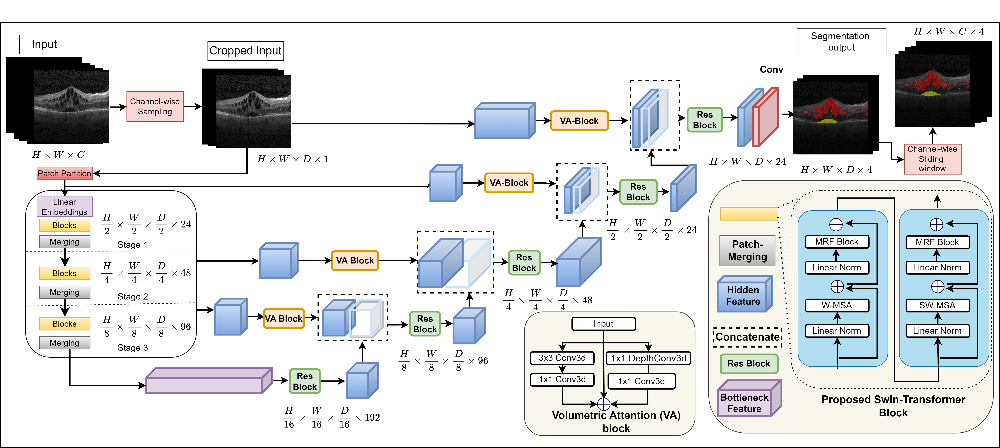

# Swin-VFTR
This code is for our paper "SwinVFTR: A Novel Volumetric Feature-learning
Transformer for 3D OCT Fluid Segmentation" implemented with PyTorch. 




### Arxiv Pre-print
```

```

# License
The code is released under the BSD 3-Clause License, you can read the license file included in the repository for details.
